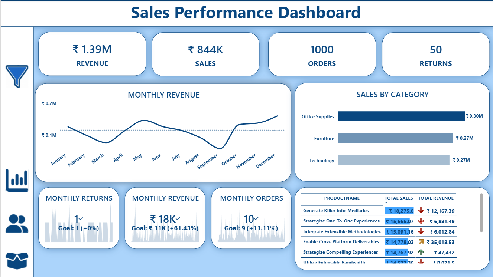
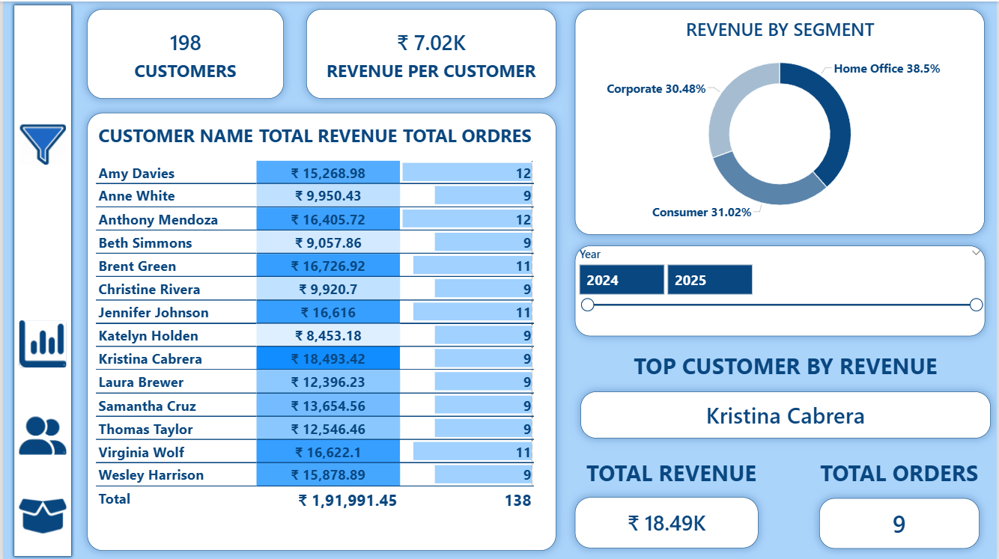
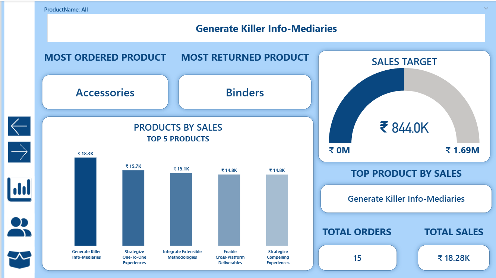

# 📊 Sales & Customer Insights Dashboard

## 📌 Project Overview

This project is an **interactive Power BI dashboard** that provides insights into sales performance, customer behavior, and product trends. It helps in making data-driven decisions using dynamic visuals, filters, drill-down features, and custom tooltips.

---

## 🚀 Key Features

* 📈 Sales Performance Analysis
* 👥 Customer Insights
* 📦 Product Performance Tracking
* 🎯 KPI Indicators (Revenue, Orders, Customers)
* 🔍 Drill-down functionality (Year → Month → Day)
* 💡 Custom Tooltips for detailed insights
* 🎛️ Interactive Filters & Slicers

---

## 📂 Project Structure

```
Dashboard-images/
│── customer-dashboard.png
│── main-dashboard.png
│── product-dashboard.png

Main File/
│── Final Project.pbix

dataset/
│── FinalProject_Dataset.xlsx

README.md
```

---

## 🛠️ Tools & Technologies

* Power BI
* Excel
* Data Visualization
* Data Analysis

---

## 📸 Dashboard Preview

### 🔹 Main Dashboard



### 🔹 Customer Dashboard



### 🔹 Product Dashboard



---

## 📊 Insights Generated

* Identified top-performing products and customers
* Analyzed sales trends over time
* Tracked revenue and order patterns
* Compared product performance (Top & Bottom)

---

## 🎯 Purpose

The goal of this project is to demonstrate **data analysis and visualization skills** using Power BI and to build an interactive dashboard for business insights.

---

## 📬 Contact

If you have any feedback or suggestions, feel free to connect!

---

⭐ If you like this project, don't forget to star the repository!
